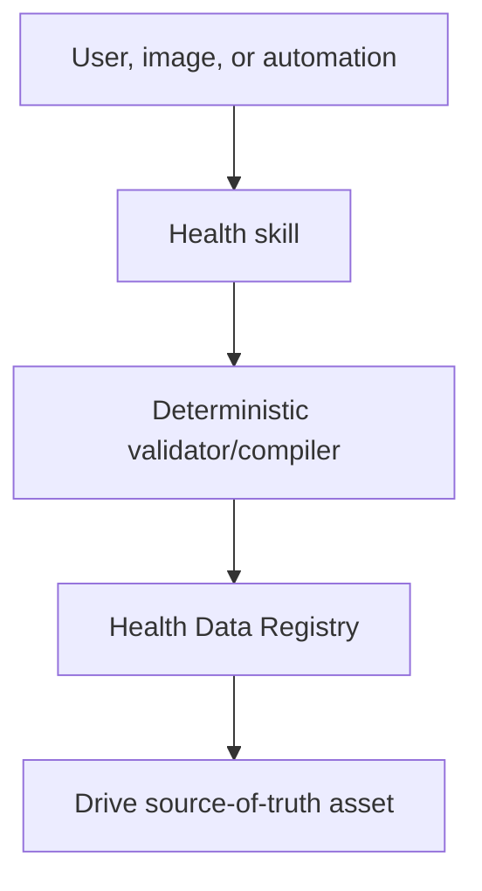

# Personal Health Automation Skills

A private, version-controlled home for the ChatGPT skills that operate the Google Drive health-data system.

## Included skills

| Skill | Purpose |
|---|---|
| `archive-garmin-data` | Archive connected Garmin data into append-only Drive snapshots. |
| `import-garmin-account-export` | Validate and normalize Garmin account export ZIPs. |
| `garmin-pantry-meal-plan` | Produce Garmin-aware, pantry-aware weekly meal plans and grocery lists. |
| `log-food` | Add consumed food to the authoritative nutrition log. |
| `reconcile-daily-food` | Find explicit consumption statements that are missing from the food log. |
| `update-pantry` | Update pantry inventory from receipts, lists, and pantry/fridge photos. |

Each folder under `skills/` is self-contained and retains its `SKILL.md`, agent metadata, deterministic scripts, and reference contracts.

## Data architecture

The skills resolve assets through the Google Drive **Health Data Registry** before reading or writing. Operational state remains in Drive; this repository contains workflow definitions and code, not exported health records.



## Validation

Run all repository checks with:

```bash
python scripts/validate_repo.py
```

The validator checks required skill files, frontmatter names, Python syntax, generated artifacts, and all bundled `test_*.py` suites.

## Privacy

The repository contains Drive file IDs and personalized workflow preferences, but no passwords, API keys, OAuth tokens, or health-record exports. Keep the repository private unless those identifiers and preferences are deliberately generalized.
