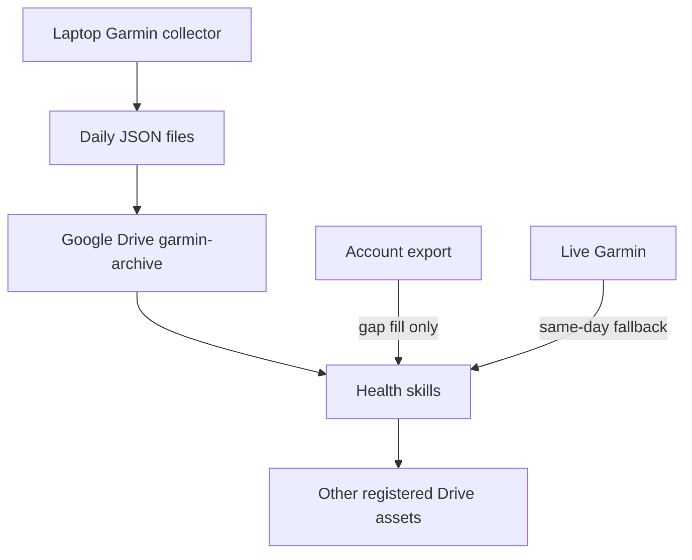

# Personal Health Automation Skills

A private, version-controlled set of ChatGPT and Claude Code workflows for the Google Drive health-data system.

## Install in Claude Code

```text
/plugin marketplace add mozaa1288/health
/plugin install health-automation@mozaa-health
/reload-plugins
```

The private repository must be available through GitHub authentication.

## Included skills

| Skill | Purpose |
|---|---|
| `archive-garmin-data` | Verify and use the cron-synced per-day Garmin JSON archive. |
| `import-garmin-account-export` | Validate Garmin export ZIPs for supplemental gap-fill history. |
| `garmin-pantry-meal-plan` | Build Garmin-aware weekly meal plans and grocery lists. |
| `log-food` | Record and review actual food consumption. |
| `reconcile-daily-food` | Find clear consumed meals that are missing from the food log. |
| `recommend-next-meal` | Recommend a practical next meal from today's log, plan, and pantry. |
| `update-pantry` | Update pantry inventory from receipts, lists, photos, and corrections. |

## Garmin data architecture

The primary Garmin source is the user's external `python-garminconnect` collector. It creates one raw file per local date:

```text
garmin_YYYY-MM-DD.json
```

Those files are synced into the Google Drive folder registered as `garmin-archive`. Skills read them directly and validate the filename date, top-level `date`, and `pulled_at` timestamp.

Garmin source precedence is:

1. Synced per-day JSON files in `garmin-archive`.
2. A validated Garmin account export only to fill missing dates or datasets.
3. The live Garmin connector only for explicit same-day freshness when the daily file has not synced.

Missing files, empty responses, and endpoint errors remain unknown and are never converted to zero.

## Design

Google Drive remains the source of truth. Skills resolve authoritative assets through the Health Data Registry before reading or writing.

The repository deliberately keeps scripts only where they add real value:

- optional raw Garmin connector-response serialization;
- Garmin export validation and cross-source normalization;
- weekly meal-plan nutrition and grocery compilation;
- Food Log row and nutrition compilation.

Reconciliation, pantry updates, and meal recommendations use direct, conservative workflows instead of intermediate JSON contracts and ranking scripts.



## Validation

```bash
python scripts/validate_repo.py
```

The validator checks the marketplace catalog, skill names, Python syntax, generated artifacts, and any bundled test files.

## Privacy

The repository contains workflow instructions, code, Drive identifiers, and personal preferences, but no passwords, OAuth tokens, Garmin exports, food-log rows, receipt images, or other health-record exports. Keep it private unless those identifiers and preferences are deliberately generalized.
