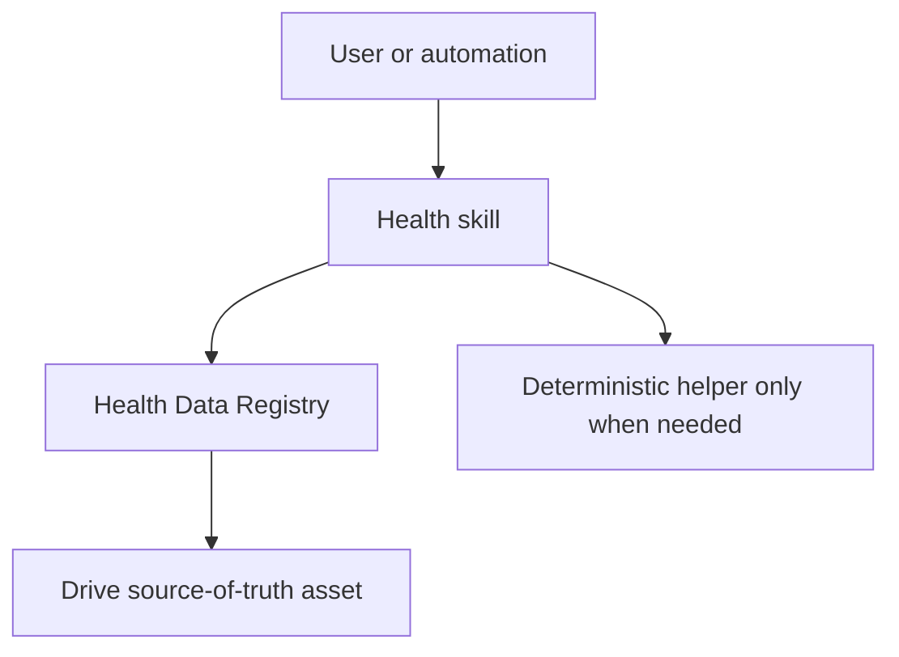

# Personal Health Automation Skills

A private, version-controlled set of ChatGPT and Claude Code workflows for the Google Drive health-data system.

## Install in Claude Code

```text
/plugin marketplace add mozaa1288/health
/plugin install health-automation@mozaa-health
/reload-plugins
```

The private repository must be available through GitHub authentication.

## Included skills

| Skill | Purpose |
|---|---|
| `archive-garmin-data` | Preserve complete rolling Garmin responses in append-only Drive snapshots. |
| `import-garmin-account-export` | Validate and normalize historical Garmin export ZIPs. |
| `garmin-pantry-meal-plan` | Build Garmin-aware weekly meal plans and grocery lists. |
| `log-food` | Record and review actual food consumption. |
| `reconcile-daily-food` | Find clear consumed meals that are missing from the food log. |
| `recommend-next-meal` | Recommend a practical next meal from today's log, plan, and pantry. |
| `update-pantry` | Update pantry inventory from receipts, lists, photos, and corrections. |

## Design

Google Drive remains the source of truth. Skills resolve authoritative assets through the Health Data Registry before reading or writing.

The repository deliberately keeps scripts only where they add real value:

- raw Garmin response serialization;
- Garmin export validation and normalization;
- weekly meal-plan nutrition and grocery compilation;
- Food Log row and nutrition compilation.

Reconciliation, pantry updates, and meal recommendations use direct, conservative workflows instead of intermediate JSON contracts and ranking scripts.



## Validation

```bash
python scripts/validate_repo.py
```

The validator checks the marketplace catalog, skill names, Python syntax, generated artifacts, and any bundled test files.

## Privacy

The repository contains workflow instructions, code, Drive identifiers, and personal preferences, but no passwords, OAuth tokens, Garmin exports, food-log rows, receipt images, or other health-record exports. Keep it private unless those identifiers and preferences are deliberately generalized.
